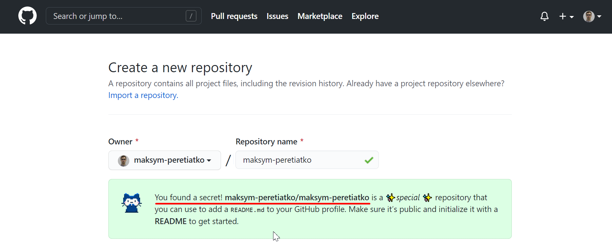

1. Create a GitHub account

https://github.com/join?ref_cta=Sign+up&ref_loc=header+logged+out&ref_page=%2F&source=header-home

2. Install CHOCOLATEY:
- run powershell as administrator
- run command:
```
Set-ExecutionPolicy Bypass -Scope Process -Force; [System.Net.ServicePointManager]::SecurityProtocol = [System.Net.ServicePointManager]::SecurityProtocol -bor 3072; iex ((New-Object System.Net.WebClient).DownloadString('https://chocolatey.org/install.ps1'))
```


3. Install git on your PC with Chocolatey:
```
choco install git -y
```
You can use the git bash terminal to work with git but I prefer ConEmu. It supports Ctrl+c and Ctrl+v commands and more friendly for me. Run command to install ConEmu:
```
choco install conemu
```

4. Configure your git:
```
git config --global user.name "John Doe"
git config --global user.email johndoe@example.com
```

5. Generate a new SSH key:
```
ssh-keygen -t ed25519 -C "your_email@example.com"
```

6. Add key to your Github profile:
- copy /c/Users/you/.ssh/id_ed25519.pub 
- go to https://github.com/settings/keys
- press a button


- past copied key to a field and press a button


Reade more: https://docs.github.com/en/github/authenticating-to-github/generating-a-new-ssh-key-and-adding-it-to-the-ssh-agent

You are ready to use GitHub now

1. Create new repository


The name of the repository should be the same as your nickname



Make sure that repository is public and initialized with a readme file, then press Create repository


2. Clone repository to your PC:
- copy link

- run command to clone repository. In my case it is:
```
git clone git@github.com:maksym-peretiatko/maksym-peretiatko.git
```

3. Open README.md file with your favourite editor. 

**maksym-peretiatko/maksym-peretiatko** is a ✨ _special_ ✨ repository because its `README.md` (this file) appears on your GitHub profile.

Here are some ideas to get you started:

- 🔭 I’m currently working on ...
- 🌱 I’m currently learning ...
- 👯 I’m looking to collaborate on ...
- 🤔 I’m looking for help with ...
- 💬 Ask me about ...
- 📫 How to reach me: ...
- 😄 Pronouns: ...
- ⚡ Fun fact: ...

You can use these suggestions or create your own profile.

4. Upload your profile:
```
git add .
git commit -m "Add your comment"
git push

